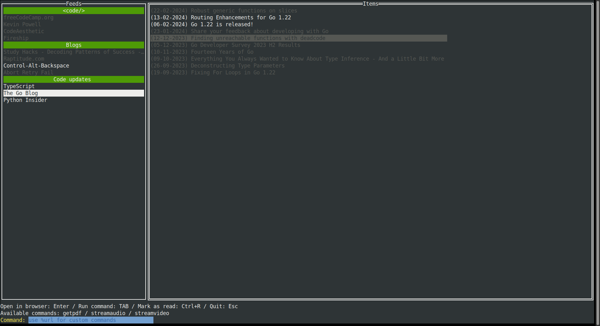

# RSSLauncher

A simple TUI RSS reader written in Go.

## Features

* Simple terminal user interface
* Organize your feeds by categories
* Launch commands using a feed item URL
* Store old items on a local DB (sqlite3)
* Exclude items based on a list of ignored words
