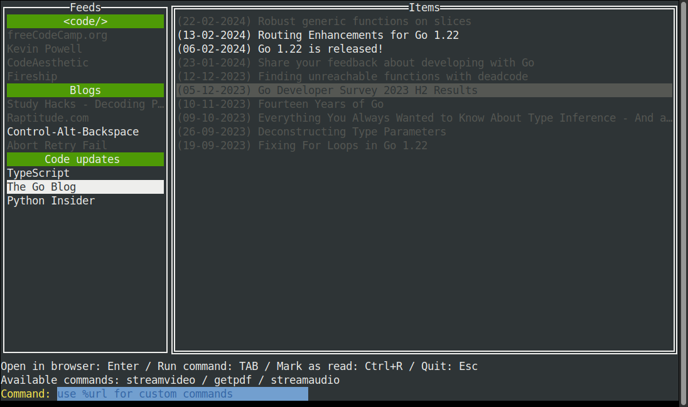

# RSSLauncher

A simple TUI RSS reader written in Go.

## Features

* Simple terminal user interface
* Organize your feeds by categories
* Import your feeds from a opml file
* Launch commands from the TUI
* Store old items on a local DB (sqlite3)
* Ignore items based on a list of blacklisted words
